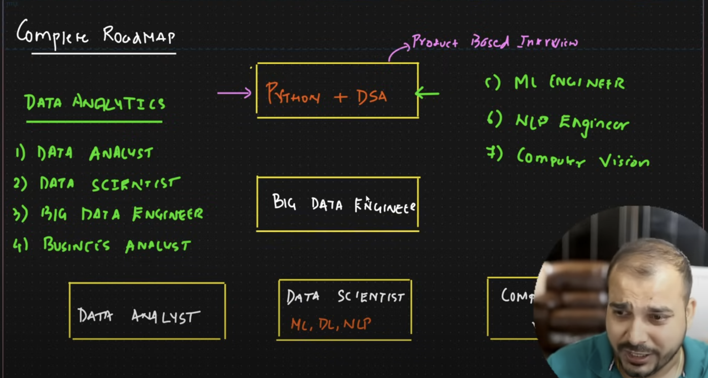
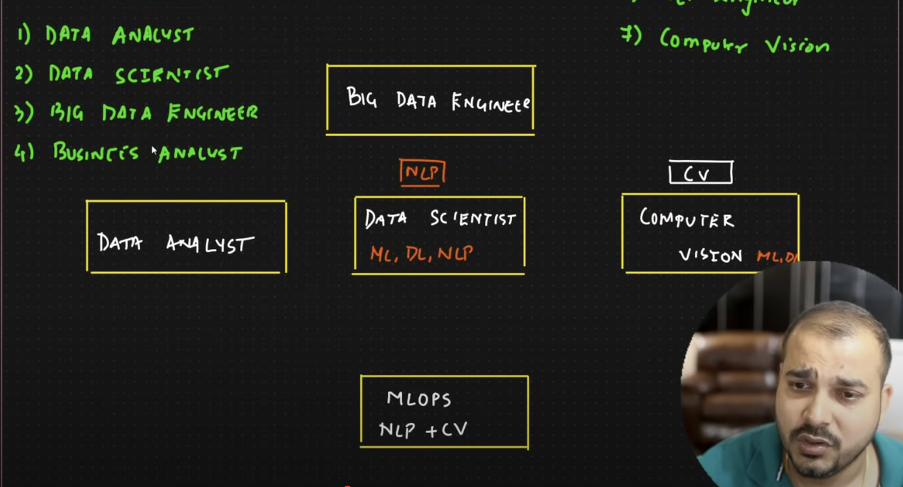
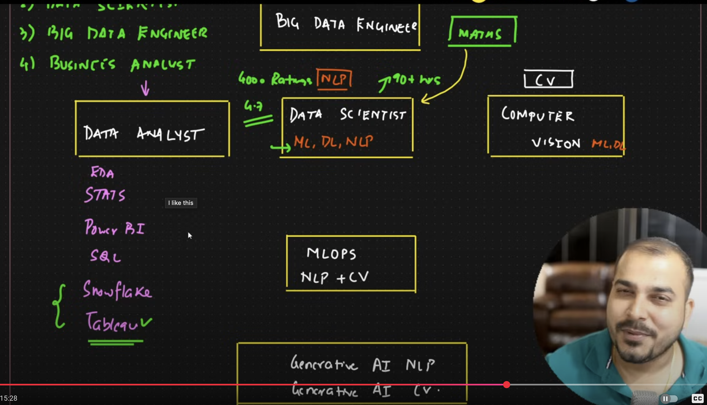

# By Krish Naik 2025 - 2026

- Roadmap to follow 2025 - 2026

  - https://www.youtube.com/watch?v=m_34mufafYY&t=362s&ab_channel=KrishNaik
  - https://www.youtube.com/watch?v=TYEqenKrbaM&ab_channel=KrishNaik

- With complete **Data Analytics Industry**, below are possible different roles

  - Data Analyst
  - Data Scientist
  - Big Data Engineer
  - Business Analyst
  - ML Engineer
  - DL Engineer
  - NLP Engineer
  - Computer Vision

  

  

  

- Follow the order
  - Python + DSA - https://www.udemy.com/course/complete-python-dsa-bootcamp
  - Mathematics-Basics to Advanced for Data Science And GenAI - https://www.udemy.com/course/mathematics-basics-to-advanced-for-data-science-and-ml/?couponCode=BESTCOUPON
  - Once comfortable on Python, either any one below
    - **Data Analyst** - https://www.udemy.com/course/complete-data-analyst-bootcamp-from-basics-to-advanced
    - **Data Scientist (ML, DL, NLP)** - https://www.udemy.com/course/complete-machine-learning-nlp-bootcamp-mlops-deployment/?couponCode=BESTCOUPON
    - Computer Vision
  - ML OPS
    - Deployments
    - End to End projects
    - ML Ops tools
  - Generative AI
    - Generative AI NLP
      - https://www.udemy.com/course/complete-generative-ai-course-with-langchain-and-huggingface/?couponCode=BESTCOUPON
      - https://www.udemy.com/course/building-gen-ai-app-end-to-end-projects-with-gemini-pro/?couponCode=BESTCOUPON
    - Generative AI CV
